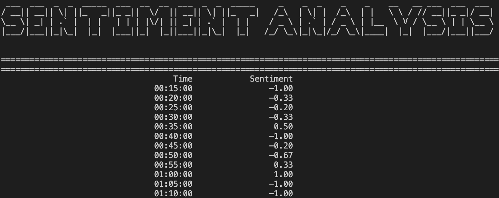

# Real-Time-Sentiment-Tracker

A tool to track WallStreetBets' "general" market sentiment in real time. Use the data to make better or worse investing decisions. Happy gambling and I do not take any responsibilty for any bad trades made using this data =) 🚀🚀🚀🚀🚀

# How to Run
        docker run -e PYTHONUNBUFFERED=1 <your_image>

Edit the fetch time to explore different time granularities (default is 5 minutes). Note that weekend threads are slower and a greater time resolution will work best.
